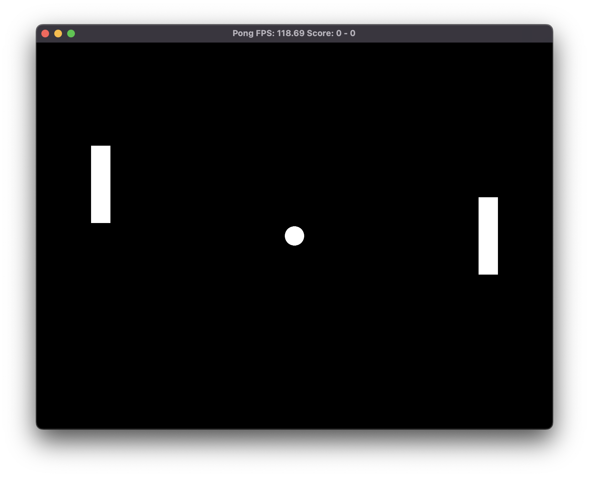

# OPonGL

Just a simple pong recreation using [OpenGL](https://www.opengl.org/) 3.3 core, [glfw](https://github.com/glfw/glfw) and [glm](https://github.com/g-truc/glm) in c++.

## Features:
- [x] Display the bats and the ball
- [ ] Display arena (background or something)
- [ ] Eye candy graphics (something other than 3 white rectangles, like an actual ball)
- [x] Control 1 bat
- [ ] Multiplayer
- [x] Simple computer behaviour (follow the ball)
- [ ] Complex computer behaviour (bounce prediction)
- [ ] Computer vs computer
- [x] Bat-Wall collision
- [x] Ball-Wall collision
- [x] Ball-Bat collision
- [x] Point
- [x] Score
- [ ] Win condition
- [x] Serve
- [ ] Main menu
- [ ] In-game settings (arena size, bat/ball velocity/size, difficulty, v-sync, etc.)

## Other Future Improvements
- Refactor the code
- Optimize some of it
- Check if it runs on anything other than MacOS, I have no idea at the moment.